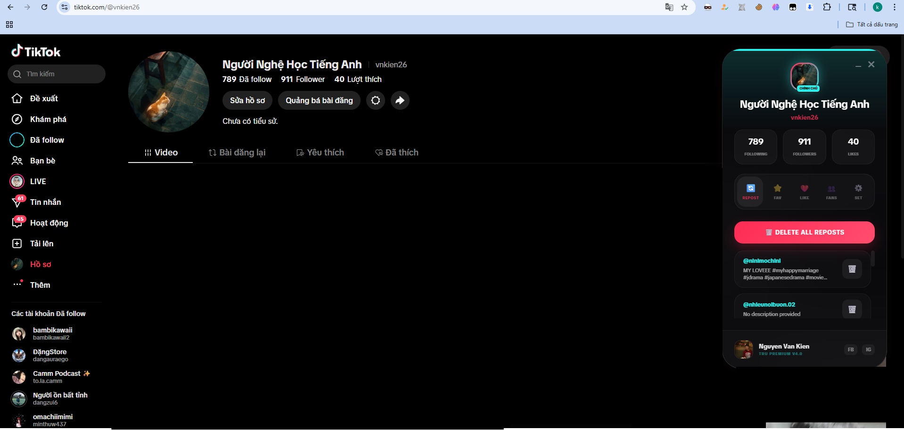

  

<h1 align="center">💎 TikTok Repost Ultimate Pro</h1>

  <strong>Giải pháp quản lý TikTok tối thượng dành cho người dùng chuyên nghiệp</strong>

  
  
  
  

---

## 🌟 Tổng quan dự án

**TikTok Repost Ultimate v4.0** không chỉ là một công cụ; đó là một trải nghiệm. Được xây dựng trên nền tảng công nghệ tự động hóa hiện đại nhất, tiện ích này giúp bạn kiểm soát hoàn toàn hồ sơ TikTok của mình một cách thông minh, nhanh chóng và an toàn tuyệt đối. 

Với thiết kế **Glassmorphism** thời thượng, TRU mang lại cảm giác cao cấp ngay từ lần đầu chạm.

---

## 🚀 Tính năng độc bản

| Tính năng | Mô tả | Lợi ích |
| :--- | :--- | :--- |
| 🗑️ **Bulk Repost Delete** | Xóa hàng nghìn video đã đăng lại chỉ trong tích tắc. | Tiết kiệm hàng giờ thao tác thủ công. |
| ❤️ **Batch Unfavorite** | Làm sạch danh sách yêu thích một cách có chọn lọc. | Tối ưu hóa thuật toán đề xuất của bạn. |
| 📊 **Live Dashboard** | Hiển thị Fans, Likes, Following thời gian thực. | Theo dõi sự phát triển tài khoản ngay lập tức. |
| 🛡️ **Anti-Ban Engine** | Thuật toán mô phỏng thao tác người dùng & Delay linh hoạt. | Đảm bảo an toàn 100% cho tài khoản. |
| 🫧 **Smart Bubble** | Giao diện thu nhỏ cực gọn, tự động ẩn khi không cần thiết. | Không làm gián đoạn trải nghiệm lướt TikTok. |
| 🎨 **Premium UI** | Giao diện kính mờ hỗ trợ Dark/Light mode hoàn hảo. | Thẩm mỹ đẳng cấp, dễ dàng sử dụng. |

---

## 📸 Hình ảnh thực tế

  
   
  <em>Giao diện hiện đại, trực quan và cực kỳ mượt mà</em>

---

## 🛠 Hướng dẫn cài đặt thần tốc

1. **Download**: Tải mã nguồn dự án về máy và giải nén.
2. **Chrome Developer**: Truy cập `chrome://extensions/` trên trình duyệt.
3. **Enable**: Bật công tắc **Developer mode** ở góc trên cùng bên phải.
4. **Load**: Nhấn vào **Load unpacked** và chọn thư mục dự án.
5. **Pin**: Ghim (Pin) tiện ích lên thanh công cụ để dễ dàng truy cập.

---

## 📖 Cách vận hành hiệu quả

*   **Bước 1**: Đăng nhập vào TikTok trên trình duyệt.
*   **Bước 2**: Truy cập vào [Trang hồ sơ cá nhân](https://www.tiktok.com/@me).
*   **Bước 3**: Nhấn vào bong bóng **TRU** ở góc màn hình.
*   **Bước 4**: Chọn Tab (Repost/Favorite) và nhấn nút hành động để bắt đầu.

> [!IMPORTANT]
> **Khuyên dùng**: Đặt mức delay từ **1.5s - 2.5s** trong phần cài đặt để có hiệu quả tốt nhất và an toàn nhất cho tài khoản của bạn.

---

## 👨‍💻 Thông tin tác giả

Dự án được phát triển và duy trì bởi **Nguyễn Văn Kiên**.

  
  

---

  <b>TikTok Repost Ultimate</b> - Nâng tầm trải nghiệm TikTok của bạn.  
  Copyright © 2024 Nguyễn Văn Kiên. All rights reserved.

